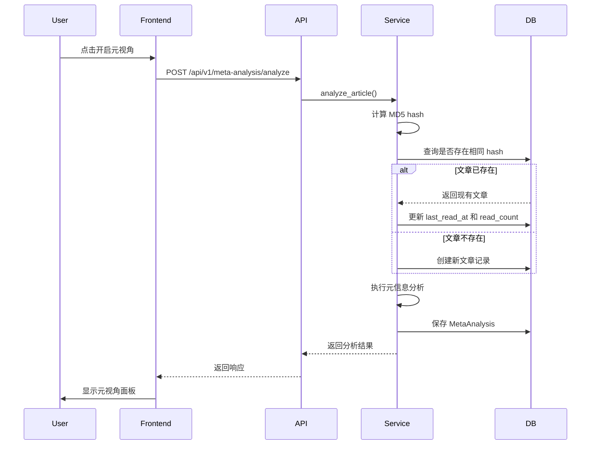
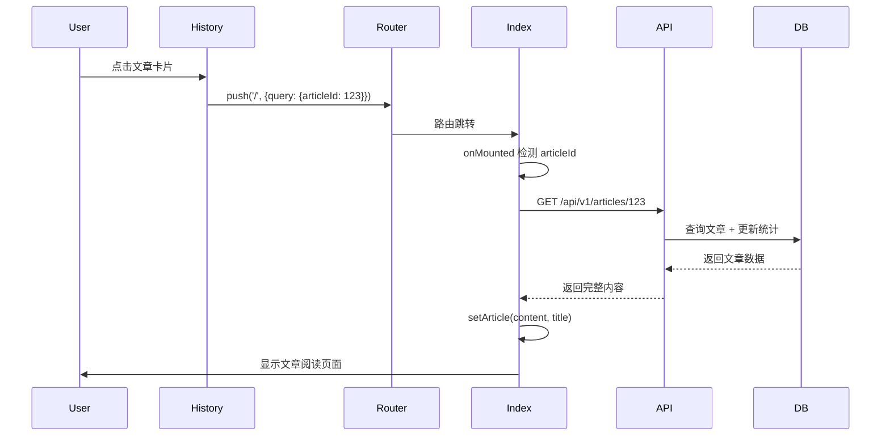

# 文章历史功能 - 实现文档

## 功能概述

文章历史功能允许用户查看他们曾经阅读过的文章，并可以随时重新打开这些文章继续阅读。系统会自动保存用户阅读的所有文章，并使用 MD5 哈希进行去重，避免重复存储相同内容。

## 核心特性

### 1. 自动文章保存
- 用户每次开启元视角分析时，文章自动保存到数据库
- 使用 MD5 哈希对文章内容进行去重
- 记录阅读次数和最后阅读时间

### 2. 历史列表展示
- 按最后阅读时间倒序显示
- 显示文章标题、作者、字数、阅读次数
- 显示首次阅读和最后阅读时间
- 标记是否有元视角分析

### 3. 统计信息
- 总阅读篇数
- 已完成元视角分析的文章数量
- 累计阅读字数

### 4. 文章操作
- 点击文章卡片重新打开文章
- 删除文章（同时删除相关的元视角分析）

## 技术实现

### 数据库设计

#### Articles 表

```python
class Article(Base):
    """文章表"""
    __tablename__ = "articles"

    id = Column(Integer, primary_key=True, index=True)
    user_id = Column(Integer, ForeignKey("users.id"), nullable=True)  # 支持匿名用户
    title = Column(String(500), nullable=False)
    author = Column(String(200), nullable=True)
    source_url = Column(String(1000), nullable=True)
    publish_date = Column(DateTime, nullable=True)
    content = Column(Text, nullable=False)  # 完整文章内容
    content_hash = Column(String(64), index=True, nullable=False)  # MD5哈希用于去重
    language = Column(String(10), default='zh', nullable=False)
    word_count = Column(Integer, nullable=True)
    created_at = Column(DateTime, default=datetime.utcnow)  # 首次阅读时间
    last_read_at = Column(DateTime, default=datetime.utcnow)  # 最后阅读时间
    read_count = Column(Integer, default=1, nullable=False)  # 阅读次数

    # 关系
    user = relationship("User", backref="articles")
    meta_analysis = relationship("MetaAnalysis", back_populates="article", uselist=False)
```

**索引优化**:
- `content_hash` 字段建立索引，加速去重查询
- `user_id` 外键自动建立索引

### 后端 API

#### 1. 获取文章列表

```
GET /api/v1/articles
```

**查询参数**:
- `user_id` (可选): 用户ID，不传则返回所有文章
- `limit` (默认20): 每页数量，范围 1-100
- `offset` (默认0): 分页偏移量

**响应示例**:
```json
{
  "total": 10,
  "limit": 20,
  "offset": 0,
  "articles": [
    {
      "id": 1,
      "title": "文章标题",
      "author": "作者名",
      "source_url": "https://...",
      "publish_date": "2025-01-15T10:00:00",
      "language": "zh",
      "word_count": 3500,
      "created_at": "2025-01-20T08:30:00",
      "last_read_at": "2025-01-20T15:45:00",
      "read_count": 3,
      "has_meta_analysis": true
    }
  ]
}
```

#### 2. 获取单篇文章

```
GET /api/v1/articles/{article_id}
```

**功能**:
- 返回文章完整内容
- 自动更新 `last_read_at` 为当前时间
- 阅读次数 +1

**响应示例**:
```json
{
  "id": 1,
  "user_id": 123,
  "title": "文章标题",
  "author": "作者名",
  "source_url": "https://...",
  "publish_date": "2025-01-15T10:00:00",
  "content": "完整文章内容...",
  "language": "zh",
  "word_count": 3500,
  "created_at": "2025-01-20T08:30:00",
  "last_read_at": "2025-01-20T15:45:00",
  "read_count": 4,
  "has_meta_analysis": true,
  "meta_analysis_id": 10
}
```

#### 3. 删除文章

```
DELETE /api/v1/articles/{article_id}
```

**功能**:
- 删除文章记录
- 通过数据库级联删除相关的元视角分析

**响应示例**:
```json
{
  "status": "success",
  "message": "文章已删除"
}
```

### 文章去重机制

#### MD5 哈希计算

```python
import hashlib

content_hash = hashlib.md5(content.encode('utf-8')).hexdigest()
```

#### 去重逻辑

```python
# 查找是否已存在相同内容的文章
article = db.query(Article).filter(
    Article.content_hash == content_hash
).first()

if article:
    # 文章已存在，更新阅读统计
    article.last_read_at = datetime.utcnow()
    article.read_count += 1
else:
    # 创建新文章记录
    article = Article(
        user_id=user_id,
        title=title,
        content=content,
        content_hash=content_hash,
        ...
    )
    db.add(article)

db.commit()
```

**优势**:
- 避免重复存储相同文章
- 通过索引快速查询（O(1) 复杂度）
- 自动累计阅读统计

### 前端实现

#### 1. 历史页面 (`/history`)

**路径**: `frontend/app/pages/history.vue`

**主要功能**:
- 统计卡片展示（总篇数、元视角数、累计字数）
- 文章列表展示
- 点击文章卡片跳转到阅读页面
- 删除文章功能

**核心代码**:

```vue
<script setup lang="ts">
const router = useRouter()
const { user } = useAuth()
const config = useRuntimeConfig()

const articles = ref<Article[]>([])
const stats = ref({
  total: 0,
  withMetaAnalysis: 0,
  totalWords: 0
})

// 获取文章列表
const fetchArticles = async () => {
  const response = await $fetch(
    `${config.public.apiBase}/api/v1/articles`,
    {
      params: {
        user_id: user.value?.id,
        limit: 50
      }
    }
  )

  articles.value = response.articles
  stats.value = {
    total: response.total,
    withMetaAnalysis: response.articles.filter(a => a.has_meta_analysis).length,
    totalWords: response.articles.reduce((sum, a) => sum + (a.word_count || 0), 0)
  }
}

// 打开文章
const openArticle = async (articleId: number) => {
  router.push({
    path: '/',
    query: { articleId }
  })
}

// 删除文章
const deleteArticle = async (articleId: number) => {
  if (!confirm('确定要删除这篇文章吗？这将同时删除相关的元视角分析。')) {
    return
  }

  await $fetch(`${config.public.apiBase}/api/v1/articles/${articleId}`, {
    method: 'DELETE'
  })

  await fetchArticles()
}

onMounted(async () => {
  await fetchArticles()
})
</script>
```

#### 2. 文章重新打开功能

**路径**: `frontend/app/pages/index.vue`

**实现逻辑**:
1. 检测 URL 查询参数 `articleId`
2. 如果存在，调用 API 获取文章详情
3. 使用 `setArticle()` 加载文章内容和标题

**核心代码**:

```typescript
// 从历史记录打开文章
const route = useRoute()
const config = useRuntimeConfig()

onMounted(async () => {
  const articleId = route.query.articleId
  if (articleId) {
    try {
      // 获取文章详情
      const article = await $fetch(
        `${config.public.apiBase}/api/v1/articles/${articleId}`
      )

      // 加载文章内容
      setArticle(article.content, article.title)

      console.log('✅ 从历史记录加载文章:', article.title)
    } catch (error) {
      console.error('❌ 加载历史文章失败:', error)
    }
  }
})
```

#### 3. 导航集成

**路径**: `frontend/app/components/AppHeader.vue`

添加了两个历史入口：

1. **顶部导航栏按钮**:
```vue
<NuxtLink to="/history">
  <Button variant="ghost" size="sm">
    <svg><!-- 书本图标 --></svg>
    阅读历史
  </Button>
</NuxtLink>
```

2. **用户下拉菜单**:
```vue
<NuxtLink to="/history" @click="showUserMenu = false">
  <button>
    <svg><!-- 书本图标 --></svg>
    <span>阅读历史</span>
  </button>
</NuxtLink>
```

## UI/UX 设计

### 统计卡片

采用 3 列网格布局，每个卡片包含：
- **图标**: 渐变色圆角背景 + 白色图标
- **数值**: 大号字体 + 渐变色文本
- **标签**: 小号灰色说明文字

**设计细节**:
- 背景: 白色 70% 透明 + 背景模糊
- 边框: 灰色 200/50 透明度
- 阴影: 轻微阴影 (shadow-sm)
- 圆角: rounded-2xl (16px)

### 文章卡片

**布局**:
- 左侧：文章信息（标题、作者、字数、阅读次数）
- 右侧：元视角标签 + 删除按钮

**交互效果**:
- 悬停时向上移动 (-translate-y-1)
- 阴影从 shadow-sm 变为 shadow-lg
- 标题颜色从 gray-900 变为 purple-600

**删除按钮**:
- 使用 `@click.stop` 阻止事件冒泡
- 悬停时背景变为红色 (hover:bg-red-50)
- 图标颜色变为红色 (hover:text-red-600)

### 日期格式化

智能相对时间显示：
- 0天: "今天"
- 1天: "昨天"
- 2-6天: "X天前"
- 7-29天: "X周前"
- 30天+: "2025年1月20日"

```typescript
const formatDate = (dateStr: string) => {
  const date = new Date(dateStr)
  const now = new Date()
  const diff = now.getTime() - date.getTime()
  const days = Math.floor(diff / (1000 * 60 * 60 * 24))

  if (days === 0) return '今天'
  if (days === 1) return '昨天'
  if (days < 7) return `${days}天前`
  if (days < 30) return `${Math.floor(days / 7)}周前`

  return date.toLocaleDateString('zh-CN', {
    year: 'numeric',
    month: 'long',
    day: 'numeric'
  })
}
```

### 数字格式化

大数字使用万为单位：

```typescript
const formatNumber = (num: number) => {
  if (num >= 10000) {
    return `${(num / 10000).toFixed(1)}万`
  }
  return num.toString()
}
```

例如：
- 5000 → "5000"
- 15000 → "1.5万"
- 123456 → "12.3万"

## 数据流程

### 文章保存流程



### 文章重新打开流程



## 性能优化

### 1. 数据库索引

```python
# content_hash 索引加速去重查询
content_hash = Column(String(64), index=True, nullable=False)

# user_id 外键自动建立索引
user_id = Column(Integer, ForeignKey("users.id"), nullable=True)
```

### 2. 分页查询

- 默认每页 20 条
- 最大每页 100 条
- 使用 `offset` 和 `limit` 进行分页

### 3. 按需加载

- 列表页面只加载摘要信息（不包含 content）
- 点击文章时才加载完整内容

### 4. 前端缓存

使用 Nuxt 的 `useState` 进行状态管理，避免重复请求：

```typescript
const articles = ref<Article[]>([])  // 文章列表缓存
const stats = ref({...})  // 统计信息缓存
```

## 安全考虑

### 1. SQL 注入防护

使用 SQLAlchemy ORM，自动进行参数化查询：

```python
# 安全的查询方式
article = db.query(Article).filter(Article.id == article_id).first()
```

### 2. 用户权限隔离

当前实现支持匿名用户（`user_id` 可为 null），未来可以添加权限检查：

```python
# 未来可添加权限检查
if article.user_id != current_user_id:
    raise HTTPException(status_code=403, detail="无权访问此文章")
```

### 3. 输入验证

使用 Pydantic 进行请求参数验证：

```python
limit: int = Query(20, ge=1, le=100)  # 限制范围 1-100
offset: int = Query(0, ge=0)  # 必须 >= 0
```

### 4. XSS 防护

Vue 自动转义 HTML，但文章内容使用 `v-html`，需注意：
- 只显示可信来源的文章内容
- 未来可考虑添加内容清理（sanitization）

## 测试要点

### 后端测试

1. **文章去重测试**:
   - 相同内容多次保存，验证只创建一条记录
   - 验证阅读次数正确递增

2. **分页测试**:
   - 验证 limit 和 offset 正确工作
   - 验证总数计算正确

3. **删除测试**:
   - 验证删除文章同时删除元视角分析
   - 验证删除不存在的文章返回 404

4. **统计更新测试**:
   - 验证 `last_read_at` 正确更新
   - 验证 `read_count` 正确递增

### 前端测试

1. **列表展示测试**:
   - 验证文章列表正确显示
   - 验证统计卡片数据正确

2. **打开文章测试**:
   - 点击文章卡片跳转到阅读页面
   - 验证文章内容正确加载
   - 验证标题正确显示

3. **删除文章测试**:
   - 验证删除确认弹窗
   - 验证删除后列表自动刷新

4. **空状态测试**:
   - 验证无文章时显示空状态
   - 验证"开始阅读"按钮跳转到首页

## 未来优化方向

### 1. 功能增强

- [ ] 添加文章搜索功能
- [ ] 支持按时间、字数、阅读次数排序
- [ ] 添加文章标签和分类
- [ ] 支持批量删除
- [ ] 添加文章收藏/归档功能

### 2. 性能优化

- [ ] 虚拟滚动优化长列表性能
- [ ] 增量加载（infinite scroll）
- [ ] 预加载文章内容

### 3. 用户体验

- [ ] 添加加载骨架屏
- [ ] 优化删除动画效果
- [ ] 添加撤销删除功能
- [ ] 支持键盘快捷键导航

### 4. 数据分析

- [ ] 阅读时长统计
- [ ] 阅读频率分析
- [ ] 热门文章排行

## 文件清单

### 后端文件

| 文件路径 | 说明 | 修改类型 |
|---------|------|---------|
| `backend/app/models/models.py` | 添加 Article 模型，修改 MetaAnalysis 关联 | 修改 |
| `backend/app/api/articles.py` | 新增文章历史 API 路由 | 新建 |
| `backend/app/services/meta_analysis_service.py` | 集成文章保存逻辑 | 修改 |
| `backend/app/main.py` | 注册 articles 路由 | 修改 |

### 前端文件

| 文件路径 | 说明 | 修改类型 |
|---------|------|---------|
| `frontend/app/pages/history.vue` | 历史文章列表页面 | 新建 |
| `frontend/app/pages/index.vue` | 添加从历史打开文章逻辑 | 修改 |
| `frontend/app/components/AppHeader.vue` | 添加历史导航入口 | 修改 |

### 文档文件

| 文件路径 | 说明 |
|---------|------|
| `docs/article-history-feature.md` | 本文档 |

## 配置说明

无需额外配置，使用现有的数据库和 API 配置即可。

## 部署注意事项

1. **数据库迁移**: 需要运行数据库迁移创建 `articles` 表
2. **存储空间**: 文章内容存储在数据库中，注意监控数据库大小
3. **备份策略**: 建议定期备份文章数据

## 常见问题

### Q1: 文章内容占用空间大吗？

A: 纯文本内容通常不大。一篇 5000 字的文章约 15KB（UTF-8 编码）。即使存储 1000 篇文章，也只需约 15MB 空间。

### Q2: 如何处理重复文章？

A: 系统使用 MD5 哈希自动去重。相同内容的文章只会存储一次，并累计阅读次数。

### Q3: 删除文章会删除元视角分析吗？

A: 是的。由于数据库设置了级联删除，删除文章会自动删除相关的元视角分析。

### Q4: 支持匿名用户吗？

A: 当前实现支持匿名用户（`user_id` 为 null）。未来可根据需求添加用户隔离。

## 总结

文章历史功能已完整实现，包括：

✅ 后端 API（列表、详情、删除）
✅ 前端历史页面（统计、列表、操作）
✅ 导航集成（顶部按钮 + 用户菜单）
✅ 文章重新打开功能
✅ MD5 去重机制
✅ 阅读统计追踪

现在用户可以：
1. 查看所有阅读过的文章
2. 查看阅读统计信息
3. 重新打开历史文章继续阅读
4. 删除不需要的文章

功能已准备就绪，可以进行测试和使用！
