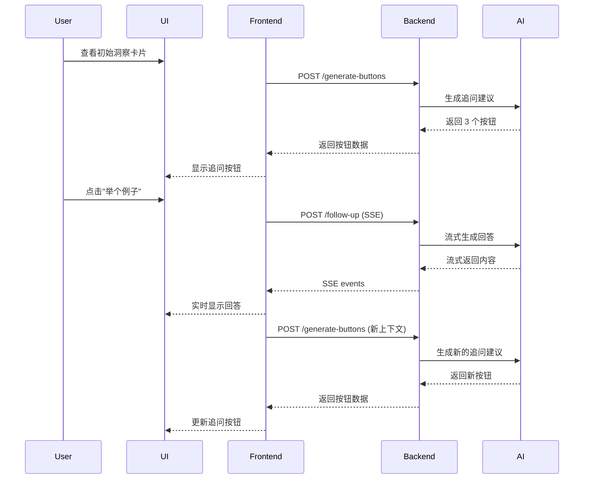
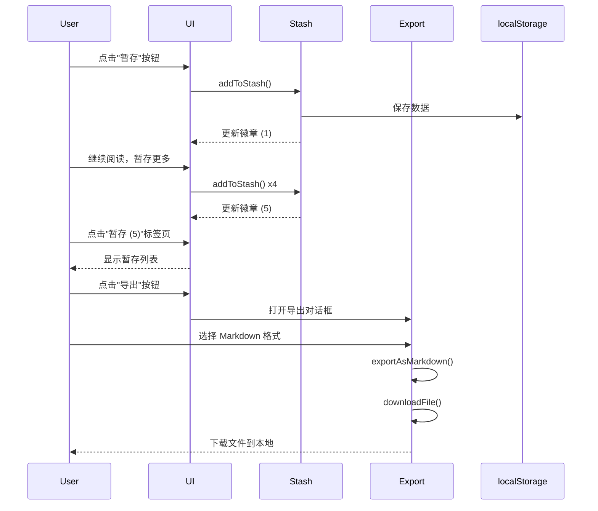

# InsightReader 功能设计文档 - 交互式洞察卡片与暂存导出

## 文档信息
- **版本**: v1.0
- **创建日期**: 2025-10-19
- **负责人**: Claude
- **状态**: 设计阶段

---

## 目录
1. [功能概述](#功能概述)
2. [需求分析](#需求分析)
3. [功能一：交互式洞察卡片](#功能一交互式洞察卡片)
4. [功能二：洞察暂存与导出](#功能二洞察暂存与导出)
5. [技术实现方案](#技术实现方案)
6. [数据库设计](#数据库设计)
7. [API 接口设计](#api-接口设计)
8. [前端组件设计](#前端组件设计)
9. [用户交互流程](#用户交互流程)
10. [开发计划](#开发计划)

---

## 功能概述

本文档设计两个核心功能，旨在将 InsightReader 从"一次性问答工具"升级为"交互式学习助手"：

1. **交互式洞察卡片 (Interactive Insight Cards)**: 在 AI 生成的洞察卡片下方提供智能追问按钮，支持多轮对话式学习
2. **洞察暂存与导出 (Insight Stash & Export)**: 在阅读会话期间暂存多个洞察卡片，支持批量导出和后续查看

---

## 需求分析

### 用户痛点

#### 痛点 1：单次问答限制了深度学习
**现状**:
- AI 生成一张静态卡片后，对话即结束
- 用户如需追问，必须重新选中文字、重新提问
- 缺乏连续性，无法形成知识链条

**用户期望**:
- 看完解释后能立即追问"举个例子"
- 对复杂概念能要求"说得再简单点"
- 能够对比相关概念，如"它和对称加密的区别？"
- AI 从"字典"变成"老师"

#### 痛点 2：阅读会话中的洞察无法留存
**现状**:
- 阅读一篇长文时，可能生成 10+ 个洞察卡片
- 切换到新问题时，旧卡片就消失了（"阅后即焚"）
- 用户的思考过程、学习轨迹没有记录
- 无法导出整理成笔记

**用户期望**:
- 能够在阅读会话中"暂存"多个洞察卡片
- 在右侧面板查看所有暂存的卡片（类似购物车）
- 阅读结束后能一键导出为 Markdown/PDF
- 洞察卡片成为有价值的学习资产

---

## 功能一：交互式洞察卡片

### 功能描述

在每张洞察卡片的底部增加"智能追问按钮"，支持用户对当前洞察进行多轮深入对话。

### 核心特性

#### 1. 智能追问按钮生成
- **上下文感知**: AI 根据当前洞察内容和意图，智能生成 3-4 个追问建议
- **动态生成**: 不同的洞察内容生成不同的追问选项
- **分类设计**:
  - 🌰 **举例类**: "举个实际例子" / "有什么应用场景？"
  - 🎯 **简化类**: "说得更简单点" / "给小学生讲讲"
  - 🔍 **对比类**: "和 XX 的区别？" / "优缺点是什么？"
  - 📚 **延伸类**: "扩展阅读推荐" / "还有什么相关概念？"

#### 2. 对话历史管理
- 每张卡片维护自己的对话历史（thread）
- 支持展开/收起对话记录
- 显示追问层级（如："第 2 次追问"）
- 对话链条可视化（树状结构）

#### 3. 自定义追问
- 除了预设按钮，保留"自定义提问"输入框
- 输入框智能补全（基于历史追问）
- 支持键盘快捷键（Enter 发送）

### UI/UX 设计

#### 卡片结构
```
┌─────────────────────────────────────────┐
│  🧠 洞察内容                              │
│  [Markdown 渲染的洞察正文]                │
│                                         │
│  ─────────────────────────────────────  │
│                                         │
│  💬 继续深入？                            │
│  [🌰 举个例子] [🎯 更简单点] [🔍 和XX区别?]  │
│  [➕ 自定义提问...]                       │
│                                         │
│  📝 对话历史 (2 轮) [展开/收起]            │
└─────────────────────────────────────────┘
```

#### 交互流程
1. 用户查看初始洞察卡片
2. 点击追问按钮（或输入自定义问题）
3. 卡片底部显示"AI 正在思考..."加载状态
4. 新的回答流式出现在对话历史区域
5. 根据新回答，AI 再次生成追问建议
6. 循环往复，形成完整对话

#### 视觉设计要点
- 初始洞察用**高亮背景**突出显示
- 追问回答用**缩进 + 左边框**表示层级
- 追问按钮使用**emerald 色系**，与品牌一致
- 对话历史默认**折叠**，避免过长

---

## 功能二：洞察暂存与导出

### 功能描述

在阅读会话中，用户可以将任意洞察卡片"暂存"到临时收藏夹（Stash），阅读结束后批量导出。

### 核心特性

#### 1. 暂存机制
- **临时性**: 暂存区是会话级别（Session-based），关闭页面后清空
- **轻量级**: 不需登录即可使用（存储在 localStorage）
- **即时性**: 点击"暂存"按钮，卡片立即添加到暂存区
- **可视化**: 右侧面板显示暂存数量徽章（如："暂存 (5)"）

#### 2. 暂存面板
- **位置**: 右侧洞察面板顶部，新增"暂存"标签页
- **切换**: 在"当前洞察"和"暂存列表"之间切换
- **预览**: 暂存列表显示卡片缩略内容
- **操作**:
  - 点击卡片可查看完整内容
  - 移除不需要的卡片
  - 调整卡片顺序（拖拽排序）

#### 3. 导出功能
- **格式支持**:
  - ✅ **Markdown**: 保留格式，适合笔记软件（Notion/Obsidian）
  - ✅ **纯文本**: 去除格式，适合剪贴板粘贴
  - 🔮 **PDF**: （可选）专业排版，适合打印
- **导出内容**:
  - 文章标题和日期
  - 所有暂存的洞察卡片
  - 每个卡片包含：选中文本、洞察内容、追问对话
- **元数据**:
  - 生成时间
  - 使用的 AI 模型
  - 总卡片数

#### 4. 与"收藏"的区别
| 特性 | 暂存 (Stash) | 收藏 (Collection) |
|------|-------------|------------------|
| 存储位置 | localStorage | 数据库 |
| 生命周期 | 会话级（临时） | 永久 |
| 是否需要登录 | ❌ 否 | ✅ 是 |
| 批量操作 | ✅ 支持 | ❌ 单个 |
| 导出功能 | ✅ 支持 | 🔮 未来 |

### UI/UX 设计

#### 暂存按钮位置
```
┌─────────────────────────────────────────┐
│  🧠 洞察内容                       [📌 暂存] │
│  [Markdown 渲染的洞察正文]                │
└─────────────────────────────────────────┘
```

#### 暂存面板结构
```
┌─────────────────────────────────────────┐
│  AI 洞察   |  📦 暂存 (5)                  │
│  ─────────────────────────────────────  │
│                                         │
│  📋 本次阅读已暂存 5 个洞察                │
│  [🗑️ 清空] [📥 导出]                      │
│                                         │
│  ┌───────────────────────────────────┐ │
│  │ 1. "非对称加密" 的解释              │ │
│  │    2 分钟前 · 87 字                │ │
│  │    [查看] [移除]                    │ │
│  └───────────────────────────────────┘ │
│                                         │
│  ┌───────────────────────────────────┐ │
│  │ 2. "康德的绝对命令" 的分析          │ │
│  │    5 分钟前 · 143 字               │ │
│  │    [查看] [移除]                    │ │
│  └───────────────────────────────────┘ │
└─────────────────────────────────────────┘
```

#### 导出对话框
```
┌─────────────────────────────────────────┐
│  📥 导出洞察笔记                          │
│                                         │
│  将导出 5 个洞察卡片                      │
│                                         │
│  选择格式：                               │
│  ◉ Markdown (.md)                      │
│  ○ 纯文本 (.txt)                        │
│  ○ PDF (.pdf) [需登录]                 │
│                                         │
│  文件名：[我的阅读笔记-2025-10-19.md]     │
│                                         │
│  [取消]  [下载]                          │
└─────────────────────────────────────────┘
```

---

## 技术实现方案

### 架构概览

```
Frontend (Nuxt 4 + Vue 3)
├── Components
│   ├── InsightPane.vue (扩展)
│   │   ├── FollowUpButtons.vue (新增)
│   │   └── ConversationThread.vue (新增)
│   ├── StashPanel.vue (新增)
│   └── ExportDialog.vue (新增)
├── Composables
│   ├── useFollowUp.ts (新增)
│   ├── useStash.ts (新增)
│   └── useExport.ts (新增)
└── Types
    ├── followup.ts (新增)
    └── stash.ts (新增)

Backend (FastAPI + SQLAlchemy)
├── API Endpoints
│   ├── POST /api/v1/insights/follow-up (新增)
│   └── POST /api/v1/insights/generate-buttons (新增)
├── Services
│   └── ai_service.py (扩展)
│       ├── generate_follow_up_buttons()
│       └── generate_follow_up_answer()
└── Models
    └── models.py
        └── ConversationThread (可选，未来持久化)
```

---

## 数据库设计

### 现有表结构（无需修改）
- `users` - 用户表
- `insight_cards` - 收藏的洞察卡片

### 新增表（可选，未来版本）

#### `conversation_threads` - 对话线程表（用于持久化对话历史）
```sql
CREATE TABLE conversation_threads (
    id INTEGER PRIMARY KEY,
    insight_card_id INTEGER,  -- 关联到初始洞察卡片（可为NULL）
    user_id INTEGER,
    session_id VARCHAR(255),  -- 会话 ID（未登录用户）

    -- 初始上下文
    initial_selected_text TEXT,
    initial_insight TEXT,

    -- 对话历史（JSON 格式）
    messages JSON,  -- [{role: 'user'|'assistant', content: '', timestamp: ''}]

    created_at DATETIME,
    updated_at DATETIME,

    FOREIGN KEY (user_id) REFERENCES users(id),
    FOREIGN KEY (insight_card_id) REFERENCES insight_cards(id)
);
```

**注**: 第一版实现时，对话历史可以只存储在前端 state 中，不需要数据库支持。

---

## API 接口设计

### 1. 生成追问按钮建议

**Endpoint**: `POST /api/v1/insights/generate-buttons`

**描述**: 根据当前洞察内容，AI 智能生成 3-4 个追问建议

**请求体**:
```json
{
  "selected_text": "非对称加密",
  "insight": "非对称加密使用一对密钥：公钥和私钥...",
  "intent": "explain",
  "conversation_history": [
    {
      "role": "user",
      "content": "举个例子"
    },
    {
      "role": "assistant",
      "content": "比如 RSA 加密算法..."
    }
  ]
}
```

**响应**:
```json
{
  "buttons": [
    {
      "id": "example",
      "label": "举个实际例子",
      "icon": "🌰",
      "category": "example"
    },
    {
      "id": "simplify",
      "label": "说得更简单点",
      "icon": "🎯",
      "category": "simplify"
    },
    {
      "id": "compare",
      "label": "和对称加密的区别？",
      "icon": "🔍",
      "category": "compare"
    }
  ]
}
```

### 2. 生成追问回答（流式）

**Endpoint**: `POST /api/v1/insights/follow-up`

**描述**: 基于对话历史，生成追问的回答（支持 SSE 流式响应）

**请求体**:
```json
{
  "selected_text": "非对称加密",
  "initial_insight": "非对称加密使用一对密钥...",
  "conversation_history": [
    {
      "role": "user",
      "content": "举个例子"
    }
  ],
  "follow_up_question": "举个实际例子",
  "use_reasoning": false
}
```

**响应** (SSE 流式):
```
data: {"type": "start", "request_id": "abc123"}
data: {"type": "delta", "content": "比如"}
data: {"type": "delta", "content": "在"}
data: {"type": "delta", "content": " HTTPS"}
...
data: {"type": "complete", "metadata": {...}}
```

---

## 前端组件设计

### 1. FollowUpButtons.vue - 追问按钮组件

**Props**:
```typescript
interface Props {
  buttons: FollowUpButton[]
  loading?: boolean
  disabled?: boolean
}
```

**Events**:
```typescript
interface Emits {
  select: [buttonId: string]
  custom: [question: string]
}
```

**UI 结构**:
```vue
<template>
  <div class="follow-up-section">
    <p class="text-sm text-gray-600 mb-2">💬 继续深入？</p>
    <div class="flex flex-wrap gap-2">
      <button
        v-for="btn in buttons"
        :key="btn.id"
        @click="emit('select', btn.id)"
        class="px-3 py-1.5 text-sm rounded-lg border border-emerald-300 bg-emerald-50 hover:bg-emerald-100"
      >
        {{ btn.icon }} {{ btn.label }}
      </button>

      <input
        v-model="customQuestion"
        @keydown.enter="handleCustomQuestion"
        placeholder="➕ 自定义提问..."
        class="flex-1 min-w-[200px] px-3 py-1.5 text-sm rounded-lg border"
      />
    </div>
  </div>
</template>
```

### 2. ConversationThread.vue - 对话历史组件

**Props**:
```typescript
interface Props {
  messages: Message[]
  collapsed?: boolean
}
```

**UI 结构**:
```vue
<template>
  <div class="conversation-thread">
    <button @click="toggle" class="flex items-center gap-2">
      <svg :class="['transition-transform', !collapsed && 'rotate-90']">...</svg>
      <span>📝 对话历史 ({{ messages.length }} 轮)</span>
    </button>

    <Transition>
      <div v-if="!collapsed" class="mt-3 space-y-3">
        <div
          v-for="(msg, idx) in messages"
          :key="idx"
          :class="['pl-4 border-l-2', msg.role === 'user' ? 'border-blue-300' : 'border-emerald-300']"
        >
          <div class="text-xs text-gray-500 mb-1">
            {{ msg.role === 'user' ? '你的追问' : 'AI 的回答' }}
          </div>
          <div class="text-sm" v-html="renderMarkdown(msg.content)"></div>
        </div>
      </div>
    </Transition>
  </div>
</template>
```

### 3. StashPanel.vue - 暂存面板组件

**功能**:
- 显示所有暂存的洞察卡片
- 支持查看、移除、排序
- 提供导出按钮

**UI 结构**:
```vue
<template>
  <div class="stash-panel">
    <div class="header">
      <h3>📦 暂存 ({{ stashItems.length }})</h3>
      <div class="actions">
        <button @click="clearAll">🗑️ 清空</button>
        <button @click="exportDialog = true">📥 导出</button>
      </div>
    </div>

    <draggable v-model="stashItems" class="stash-list">
      <div
        v-for="item in stashItems"
        :key="item.id"
        class="stash-item"
      >
        <div class="item-preview">
          <h4>{{ truncate(item.selectedText, 30) }}</h4>
          <p class="meta">{{ formatTime(item.timestamp) }} · {{ item.insight.length }} 字</p>
        </div>
        <div class="item-actions">
          <button @click="viewItem(item)">查看</button>
          <button @click="removeItem(item.id)">移除</button>
        </div>
      </div>
    </draggable>
  </div>
</template>
```

### 4. ExportDialog.vue - 导出对话框组件

**功能**:
- 选择导出格式（Markdown / TXT / PDF）
- 自定义文件名
- 一键下载

---

## Composables 设计

### 1. useFollowUp.ts - 追问管理

```typescript
export const useFollowUp = () => {
  const conversationHistory = ref<Message[]>([])
  const followUpButtons = ref<FollowUpButton[]>([])
  const isGenerating = ref(false)

  // 生成追问按钮
  const generateButtons = async (context: ButtonGenerationContext) => {
    const response = await $fetch('/api/v1/insights/generate-buttons', {
      method: 'POST',
      body: context
    })
    followUpButtons.value = response.buttons
  }

  // 发送追问并获取回答
  const askFollowUp = async (question: string) => {
    isGenerating.value = true
    conversationHistory.value.push({ role: 'user', content: question })

    const { connect } = useSSE()
    let answer = ''

    await connect('/api/v1/insights/follow-up', {
      // ... request data
    }, {
      onDelta: (content) => {
        answer += content
      },
      onComplete: () => {
        conversationHistory.value.push({ role: 'assistant', content: answer })
        generateButtons(/* new context */)
        isGenerating.value = false
      }
    })
  }

  return {
    conversationHistory: readonly(conversationHistory),
    followUpButtons: readonly(followUpButtons),
    isGenerating: readonly(isGenerating),
    generateButtons,
    askFollowUp,
    clearHistory: () => conversationHistory.value = []
  }
}
```

### 2. useStash.ts - 暂存管理

```typescript
export const useStash = () => {
  const stashItems = useState<StashItem[]>('stash-items', () => [])
  const STORAGE_KEY = 'insightreader_stash'

  // 添加到暂存
  const addToStash = (item: Omit<StashItem, 'id' | 'timestamp'>) => {
    const newItem: StashItem = {
      ...item,
      id: generateId(),
      timestamp: Date.now()
    }
    stashItems.value.push(newItem)
    saveToStorage()
  }

  // 从暂存移除
  const removeFromStash = (id: string) => {
    stashItems.value = stashItems.value.filter(item => item.id !== id)
    saveToStorage()
  }

  // 清空暂存
  const clearStash = () => {
    stashItems.value = []
    if (process.client) {
      localStorage.removeItem(STORAGE_KEY)
    }
  }

  // 从 localStorage 加载
  const loadFromStorage = () => {
    if (process.client) {
      const stored = localStorage.getItem(STORAGE_KEY)
      if (stored) {
        stashItems.value = JSON.parse(stored)
      }
    }
  }

  // 保存到 localStorage
  const saveToStorage = () => {
    if (process.client) {
      localStorage.setItem(STORAGE_KEY, JSON.stringify(stashItems.value))
    }
  }

  onMounted(() => {
    loadFromStorage()
  })

  return {
    stashItems: readonly(stashItems),
    addToStash,
    removeFromStash,
    clearStash
  }
}
```

### 3. useExport.ts - 导出功能

```typescript
export const useExport = () => {
  // 导出为 Markdown
  const exportAsMarkdown = (items: StashItem[], articleTitle?: string) => {
    let markdown = `# ${articleTitle || '我的阅读笔记'}\n\n`
    markdown += `生成时间：${new Date().toLocaleString()}\n`
    markdown += `共 ${items.length} 个洞察\n\n`
    markdown += '---\n\n'

    items.forEach((item, idx) => {
      markdown += `## ${idx + 1}. ${item.selectedText}\n\n`
      markdown += `**意图**: ${getIntentLabel(item.intent)}\n\n`

      if (item.customQuestion) {
        markdown += `**问题**: ${item.customQuestion}\n\n`
      }

      markdown += `### 洞察内容\n\n${item.insight}\n\n`

      if (item.conversationHistory && item.conversationHistory.length > 0) {
        markdown += `### 对话记录\n\n`
        item.conversationHistory.forEach((msg) => {
          const prefix = msg.role === 'user' ? '**你**' : '**AI**'
          markdown += `${prefix}: ${msg.content}\n\n`
        })
      }

      markdown += '---\n\n'
    })

    return markdown
  }

  // 导出为纯文本
  const exportAsText = (items: StashItem[]) => {
    // 类似 Markdown 但去除格式符号
  }

  // 触发下载
  const downloadFile = (content: string, filename: string, mimeType: string) => {
    const blob = new Blob([content], { type: mimeType })
    const url = URL.createObjectURL(blob)
    const link = document.createElement('a')
    link.href = url
    link.download = filename
    document.body.appendChild(link)
    link.click()
    document.body.removeChild(link)
    URL.revokeObjectURL(url)
  }

  // 导出洞察笔记
  const exportInsights = (items: StashItem[], format: 'md' | 'txt', filename?: string) => {
    const timestamp = new Date().toISOString().split('T')[0]
    const defaultFilename = `我的阅读笔记-${timestamp}`

    let content: string
    let mimeType: string
    let extension: string

    switch (format) {
      case 'md':
        content = exportAsMarkdown(items)
        mimeType = 'text/markdown'
        extension = 'md'
        break
      case 'txt':
        content = exportAsText(items)
        mimeType = 'text/plain'
        extension = 'txt'
        break
    }

    downloadFile(content, `${filename || defaultFilename}.${extension}`, mimeType)
  }

  return {
    exportInsights,
    exportAsMarkdown,
    exportAsText
  }
}
```

---

## 用户交互流程

### 流程 1：交互式追问



### 流程 2：暂存与导出



---

## 开发计划

### 阶段 1：交互式洞察卡片（第 1-2 天）

#### 后端任务
- [ ] 在 `ai_service.py` 中实现 `generate_follow_up_buttons()`
- [ ] 在 `ai_service.py` 中实现 `generate_follow_up_answer_stream()`
- [ ] 在 `insights.py` 中添加 `POST /api/v1/insights/generate-buttons` 端点
- [ ] 在 `insights.py` 中添加 `POST /api/v1/insights/follow-up` 端点（SSE）

#### 前端任务
- [ ] 创建 `types/followup.ts` 类型定义
- [ ] 实现 `useFollowUp.ts` composable
- [ ] 创建 `FollowUpButtons.vue` 组件
- [ ] 创建 `ConversationThread.vue` 组件
- [ ] 在 `InsightPane.vue` 中集成追问功能

#### 测试任务
- [ ] 测试追问按钮生成逻辑
- [ ] 测试多轮对话流程
- [ ] 测试自定义追问功能
- [ ] 测试对话历史展示

### 阶段 2：洞察暂存与导出（第 3-4 天）

#### 前端任务
- [ ] 创建 `types/stash.ts` 类型定义
- [ ] 实现 `useStash.ts` composable
- [ ] 实现 `useExport.ts` composable
- [ ] 创建 `StashPanel.vue` 组件
- [ ] 创建 `ExportDialog.vue` 组件
- [ ] 在 `InsightPane.vue` 中添加暂存按钮
- [ ] 在右侧面板添加"暂存"标签页切换

#### 测试任务
- [ ] 测试暂存添加/移除功能
- [ ] 测试 localStorage 持久化
- [ ] 测试 Markdown 导出格式
- [ ] 测试纯文本导出格式
- [ ] 测试多卡片场景（10+ 卡片）

### 阶段 3：优化与完善（第 5 天）

- [ ] UI/UX 细节打磨
- [ ] 添加加载动画和过渡效果
- [ ] 错误处理和边界情况
- [ ] 性能优化（大量对话历史）
- [ ] 移动端适配
- [ ] 编写用户文档

---

## 技术风险与解决方案

### 风险 1：追问按钮生成不够智能
**风险**: AI 生成的追问建议不符合上下文，用户体验差

**解决方案**:
- 使用高质量 prompt，明确要求生成"用户最可能感兴趣"的追问
- 提供对话历史作为上下文，避免重复建议
- 设置固定模板（如"举例" "简化" "对比"），确保基本可用性
- 收集用户反馈，迭代优化 prompt

### 风险 2：对话历史过长影响性能
**风险**: 用户连续追问 10+ 轮，对话历史占用大量内存和 token

**解决方案**:
- 限制对话历史最多保留 10 轮
- 超过限制时，自动总结早期对话（使用 AI）
- 前端使用虚拟滚动渲染大量对话
- 提供"重置对话"按钮，清空历史重新开始

### 风险 3：暂存数据丢失
**风险**: 用户误关闭标签页，localStorage 被清空

**解决方案**:
- 在页面关闭前弹出确认框（如果有暂存数据）
- 提供"导出前先预览"功能，避免误操作
- 未来版本：支持自动保存到云端（需登录）

---

## 成功指标

### 用户体验指标
- 追问功能使用率 > 30%（每次洞察生成后，30% 用户会点击追问）
- 平均对话轮数 ≥ 2 轮（证明追问有价值）
- 暂存功能使用率 > 20%（每次阅读会话中，20% 用户会暂存卡片）
- 导出功能使用率 > 50%（暂存用户中，50% 会导出）

### 技术指标
- 追问按钮生成延迟 < 1 秒
- 追问回答流式响应延迟 < 500ms（首字符）
- 暂存操作延迟 < 100ms
- 导出 10 个卡片耗时 < 2 秒

---

## 未来扩展

### V2.0 功能
- [ ] 对话分支可视化（树状图）
- [ ] 追问智能推荐优化（基于用户历史偏好）
- [ ] 暂存支持云端同步（登录用户）
- [ ] PDF 导出支持（专业排版）
- [ ] 支持导出到 Notion/Obsidian（API 集成）

### V3.0 功能
- [ ] 多人协作暂存（分享暂存列表）
- [ ] 语音追问（语音输入问题）
- [ ] 视觉化知识图谱（将多个洞察关联起来）

---

## 总结

本设计文档定义了两个核心功能：

1. **交互式洞察卡片**: 通过智能追问按钮和多轮对话，将 InsightReader 从"字典"升级为"老师"
2. **洞察暂存与导出**: 通过临时暂存和批量导出，将阅读思考过程转化为可留存的学习资产

这两个功能相辅相成，共同提升用户的学习深度和效率。实现后，InsightReader 将成为真正的"交互式学习助手"。
