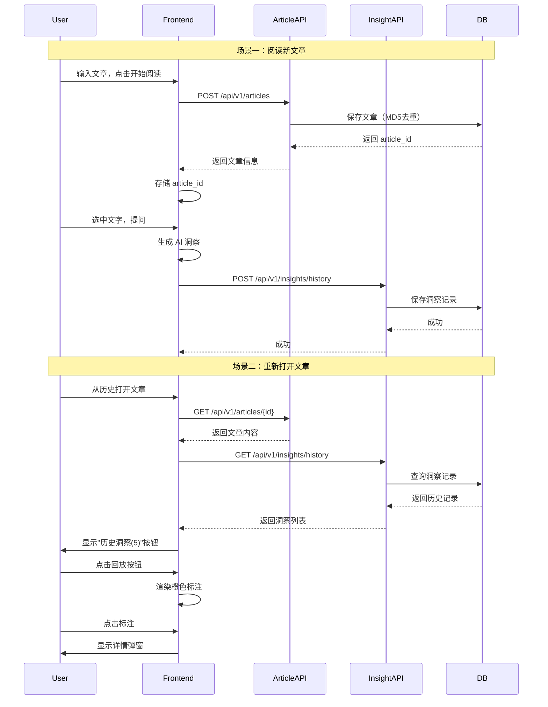

# 洞察回放功能 - 设计文档

## 功能概述

**核心价值**：让用户能够查看自己在阅读文章时提出的所有问题和获得的洞察，支持"划线回放"。

## 用户故事

### 场景一：阅读新文章
1. 用户输入文章内容，点击"开始阅读"
2. **系统自动保存文章**到数据库（无需等待元视角）
3. 用户选中文字，提问："这段话的意思是什么？"
4. AI 返回洞察
5. **系统保存这次洞察记录**（选中文本位置、问题、答案）

### 场景二：重新打开旧文章
1. 用户从历史记录打开之前读过的文章
2. 文章顶部显示：**"历史洞察（5）"** 按钮
3. 点击按钮，文章中之前提问过的地方**显示橙色标注线**
4. 点击标注线，弹出卡片显示：
   - 选中的文本
   - 当时的问题
   - AI 的回答
   - 提问时间
5. 可以在标注间跳转导航

## 数据库设计

### InsightHistory 表（新增）

存储用户的每次 AI 洞察记录。

```python
class InsightHistory(Base):
    """洞察历史表 - 记录用户的每次 AI 提问"""
    __tablename__ = "insight_history"

    id = Column(Integer, primary_key=True, index=True)
    article_id = Column(Integer, ForeignKey("articles.id"), nullable=False, index=True)
    user_id = Column(Integer, ForeignKey("users.id"), nullable=True, index=True)

    # 选中的文本
    selected_text = Column(Text, nullable=False)  # 用户选中的原文
    selected_start = Column(Integer, nullable=True)  # 在文章中的起始位置（字符索引）
    selected_end = Column(Integer, nullable=True)  # 结束位置

    # 上下文（用于重新定位）
    context_before = Column(String(200), nullable=True)  # 前50字
    context_after = Column(String(200), nullable=True)  # 后50字

    # 问题和答案
    intent = Column(String(50), nullable=False)  # 'explain' | 'summarize' | 'question' | ...
    question = Column(Text, nullable=True)  # 如果是自定义问题
    insight = Column(Text, nullable=False)  # AI 的回答
    reasoning = Column(Text, nullable=True)  # 推理过程（如果有）

    # 元数据
    created_at = Column(DateTime, default=datetime.utcnow, index=True)

    # 关系
    article = relationship("Article", backref="insight_history")
    user = relationship("User", backref="insight_history")
```

**索引策略**：
- `(article_id, user_id)` 组合索引：快速查询某文章的所有洞察
- `created_at` 索引：按时间排序

### Article 表修改

添加洞察计数字段：

```python
class Article(Base):
    # ... 现有字段
    insight_count = Column(Integer, default=0, nullable=False)  # 洞察次数
```

## API 设计

### 1. 保存文章（修改）

```
POST /api/v1/articles
```

**请求体**：
```json
{
  "title": "文章标题",
  "author": "作者",
  "content": "完整内容",
  "user_id": 123,
  "source_url": "https://..."
}
```

**响应**：
```json
{
  "status": "success",
  "article": {
    "id": 456,
    "title": "文章标题",
    "content_hash": "abc123...",
    "is_new": true  // 是新文章还是已存在
  }
}
```

**逻辑**：
- MD5 去重，如果已存在则返回现有文章
- 更新 `last_read_at` 和 `read_count`

---

### 2. 保存洞察记录（新增）

```
POST /api/v1/insights/history
```

**请求体**：
```json
{
  "article_id": 456,
  "user_id": 123,
  "selected_text": "这是用户选中的一段文字",
  "selected_start": 150,
  "selected_end": 200,
  "context_before": "...前面的50字...",
  "context_after": "...后面的50字...",
  "intent": "explain",
  "question": null,
  "insight": "AI的回答内容...",
  "reasoning": "推理过程..."
}
```

**响应**：
```json
{
  "status": "success",
  "insight_history_id": 789
}
```

**触发时机**：
- 用户每次获得 AI 洞察后**自动调用**
- 前端在 `useInsightGenerator` 的 `generate()` 成功后保存

---

### 3. 获取文章的洞察历史（新增）

```
GET /api/v1/insights/history?article_id=456&user_id=123
```

**响应**：
```json
{
  "total": 5,
  "insights": [
    {
      "id": 789,
      "selected_text": "这是用户选中的一段文字",
      "selected_start": 150,
      "selected_end": 200,
      "context_before": "...",
      "context_after": "...",
      "intent": "explain",
      "question": null,
      "insight": "AI的回答内容...",
      "reasoning": null,
      "created_at": "2025-01-20T10:30:00Z"
    }
  ]
}
```

**使用场景**：
- 用户重新打开文章时调用
- 获取所有历史提问，用于渲染标注

---

## 前端实现

### 1. 文章保存触发点调整

**修改位置**：`frontend/app/pages/index.vue`

**修改逻辑**：
```typescript
// 在 setArticle 时立即保存文章
const handleArticleSubmit = async (articleContent: string) => {
  setArticle(articleContent)

  // 立即保存文章到后端
  if (user.value?.id) {
    try {
      const article = await $fetch(`${config.public.apiBase}/api/v1/articles`, {
        method: 'POST',
        body: {
          title: title.value,
          author: 'Unknown',
          content: articleContent,
          user_id: user.value.id
        }
      })

      // 保存 article_id 到全局状态
      currentArticleId.value = article.article.id

      console.log('✅ 文章已保存:', article.article.id)
    } catch (error) {
      console.error('❌ 保存文章失败:', error)
    }
  }
}
```

---

### 2. 保存洞察记录

**修改位置**：`frontend/app/composables/useInsightGenerator.ts`

**在生成洞察成功后保存**：
```typescript
export const useInsightGenerator = () => {
  const generate = async (request: InsightRequest) => {
    // ... 现有的生成逻辑

    // 生成成功后保存到历史
    if (currentInsight.value && currentArticleId.value) {
      try {
        await $fetch(`${config.public.apiBase}/api/v1/insights/history`, {
          method: 'POST',
          body: {
            article_id: currentArticleId.value,
            user_id: user.value?.id,
            selected_text: request.selected_text,
            selected_start: calculatePosition(request.selected_text),  // 计算位置
            selected_end: calculatePosition(request.selected_text) + request.selected_text.length,
            context_before: extractContext(request.context, 'before'),
            context_after: extractContext(request.context, 'after'),
            intent: request.intent,
            question: request.custom_question,
            insight: currentInsight.value,
            reasoning: currentReasoning.value
          }
        })

        console.log('✅ 洞察已保存到历史')
      } catch (error) {
        console.error('❌ 保存洞察历史失败:', error)
      }
    }
  }
}
```

---

### 3. 洞察回放 Composable（新增）

**文件**：`frontend/app/composables/useInsightReplay.ts`

```typescript
export interface InsightHistoryItem {
  id: number
  selected_text: string
  selected_start: number
  selected_end: number
  context_before: string
  context_after: string
  intent: string
  question: string | null
  insight: string
  reasoning: string | null
  created_at: string
}

export const useInsightReplay = () => {
  const config = useRuntimeConfig()

  // 状态
  const insightHistory = useState<InsightHistoryItem[]>('insight-history', () => [])
  const isReplayMode = useState<boolean>('is-replay-mode', () => false)
  const selectedHistoryItem = useState<InsightHistoryItem | null>('selected-history-item', () => null)

  /**
   * 加载文章的洞察历史
   */
  const loadInsightHistory = async (articleId: number, userId?: number) => {
    try {
      const response = await $fetch<{ total: number; insights: InsightHistoryItem[] }>(
        `${config.public.apiBase}/api/v1/insights/history`,
        {
          params: { article_id: articleId, user_id: userId }
        }
      )

      insightHistory.value = response.insights
      console.log('✅ 加载了', response.total, '条洞察历史')

      return response.insights
    } catch (error) {
      console.error('❌ 加载洞察历史失败:', error)
      return []
    }
  }

  /**
   * 切换回放模式
   */
  const toggleReplayMode = () => {
    isReplayMode.value = !isReplayMode.value

    if (!isReplayMode.value) {
      selectedHistoryItem.value = null
    }
  }

  /**
   * 渲染历史标注到 DOM
   */
  const renderHistoryHighlights = (containerEl: HTMLElement, history: InsightHistoryItem[]) => {
    // 清除旧的标注
    removeHistoryHighlights(containerEl)

    // 使用文本匹配算法渲染每个标注
    for (const item of history) {
      try {
        highlightHistoryItem(containerEl, item)
      } catch (error) {
        console.error('❌ 渲染标注失败:', item.selected_text.substring(0, 30), error)
      }
    }
  }

  /**
   * 在 DOM 中高亮历史项
   */
  const highlightHistoryItem = (containerEl: HTMLElement, item: InsightHistoryItem) => {
    const searchText = item.selected_text.trim()
    if (!searchText) return

    // 使用 TreeWalker 查找文本
    const walker = document.createTreeWalker(
      containerEl,
      NodeFilter.SHOW_TEXT,
      {
        acceptNode: (node) => {
          const parent = node.parentElement
          if (parent?.classList.contains('insight-replay-highlight')) {
            return NodeFilter.FILTER_REJECT
          }
          return node.textContent?.trim() ? NodeFilter.FILTER_ACCEPT : NodeFilter.FILTER_REJECT
        }
      }
    )

    const textNodes: Text[] = []
    let currentNode: Node | null
    while ((currentNode = walker.nextNode())) {
      textNodes.push(currentNode as Text)
    }

    // 查找匹配
    for (const textNode of textNodes) {
      const text = textNode.textContent || ''
      const index = text.indexOf(searchText)

      if (index !== -1) {
        const beforeText = text.substring(0, index)
        const matchText = text.substring(index, index + searchText.length)
        const afterText = text.substring(index + searchText.length)

        const parent = textNode.parentNode
        if (!parent) continue

        // 创建标注元素
        const highlightEl = createHistoryHighlightElement(matchText, item)

        // 替换文本节点
        if (beforeText) {
          parent.insertBefore(document.createTextNode(beforeText), textNode)
        }
        parent.insertBefore(highlightEl, textNode)
        if (afterText) {
          parent.insertBefore(document.createTextNode(afterText), textNode)
        }
        parent.removeChild(textNode)

        break
      }
    }
  }

  /**
   * 创建历史标注元素
   */
  const createHistoryHighlightElement = (text: string, item: InsightHistoryItem): HTMLElement => {
    const span = document.createElement('span')
    span.className = 'insight-replay-highlight'
    span.dataset.insightId = item.id.toString()

    // 样式：橙色下划线
    span.style.borderBottom = '3px solid #f97316'
    span.style.cursor = 'pointer'
    span.style.backgroundColor = 'rgba(249, 115, 22, 0.1)'
    span.style.transition = 'all 0.2s ease'
    span.textContent = text

    // 点击显示详情
    span.addEventListener('click', (e) => {
      e.stopPropagation()
      selectedHistoryItem.value = item
    })

    // 悬停效果
    span.addEventListener('mouseenter', () => {
      span.style.backgroundColor = 'rgba(249, 115, 22, 0.2)'
    })
    span.addEventListener('mouseleave', () => {
      span.style.backgroundColor = 'rgba(249, 115, 22, 0.1)'
    })

    return span
  }

  /**
   * 移除历史标注
   */
  const removeHistoryHighlights = (containerEl: HTMLElement) => {
    const highlights = containerEl.querySelectorAll('.insight-replay-highlight')
    highlights.forEach(el => {
      const parent = el.parentNode
      if (parent) {
        const textNode = document.createTextNode(el.textContent || '')
        parent.replaceChild(textNode, el)
      }
    })
    containerEl.normalize()
  }

  /**
   * 清空回放状态
   */
  const clearReplayState = () => {
    insightHistory.value = []
    isReplayMode.value = false
    selectedHistoryItem.value = null
  }

  return {
    // 状态
    insightHistory: readonly(insightHistory),
    isReplayMode: readonly(isReplayMode),
    selectedHistoryItem: readonly(selectedHistoryItem),

    // 方法
    loadInsightHistory,
    toggleReplayMode,
    renderHistoryHighlights,
    removeHistoryHighlights,
    clearReplayState,
    selectHistoryItem: (item: InsightHistoryItem | null) => {
      selectedHistoryItem.value = item
    }
  }
}
```

---

### 4. 回放控制按钮组件（新增）

**文件**：`frontend/app/components/InsightReplayButton.vue`

```vue
<template>
  <Transition
    enter-active-class="transition-all duration-300"
    enter-from-class="opacity-0 translate-y-2"
    enter-to-class="opacity-100 translate-y-0"
    leave-active-class="transition-all duration-200"
    leave-from-class="opacity-100"
    leave-to-class="opacity-0"
  >
    <button
      v-if="insightCount > 0"
      @click="handleToggle"
      :class="[
        'fixed z-50 px-4 py-2 rounded-full shadow-lg transition-all duration-300',
        'bottom-40 right-8',
        'flex items-center gap-2',
        isReplayMode
          ? 'bg-gradient-to-r from-orange-500 to-amber-600 text-white'
          : 'bg-white border-2 border-orange-500 text-orange-600 hover:bg-orange-50'
      ]"
    >
      <svg class="w-5 h-5" fill="none" stroke="currentColor" viewBox="0 0 24 24">
        <path stroke-linecap="round" stroke-linejoin="round" stroke-width="2"
              d="M7 8h10M7 12h4m1 8l-4-4H5a2 2 0 01-2-2V6a2 2 0 012-2h14a2 2 0 012 2v8a2 2 0 01-2 2h-3l-4 4z" />
      </svg>
      <span class="font-medium">
        {{ isReplayMode ? '关闭回放' : `历史洞察 (${insightCount})` }}
      </span>
    </button>
  </Transition>
</template>

<script setup lang="ts">
const props = defineProps<{
  insightCount: number
}>()

const { isReplayMode, toggleReplayMode, renderHistoryHighlights, removeHistoryHighlights, insightHistory } = useInsightReplay()

const handleToggle = () => {
  toggleReplayMode()

  // 渲染或移除标注
  const containerEl = document.getElementById('article-content-container')
  if (!containerEl) return

  if (isReplayMode.value) {
    renderHistoryHighlights(containerEl, insightHistory.value)
  } else {
    removeHistoryHighlights(containerEl)
  }
}
</script>
```

---

### 5. 洞察详情弹窗组件（新增）

**文件**：`frontend/app/components/InsightHistoryModal.vue`

```vue
<template>
  <Transition
    enter-active-class="transition-opacity duration-200"
    enter-from-class="opacity-0"
    enter-to-class="opacity-100"
    leave-active-class="transition-opacity duration-150"
    leave-from-class="opacity-100"
    leave-to-class="opacity-0"
  >
    <div
      v-if="selectedItem"
      class="fixed inset-0 bg-black/30 backdrop-blur-sm z-50 flex items-center justify-center p-4"
      @click="close"
    >
      <div
        class="bg-white rounded-2xl shadow-2xl max-w-2xl w-full max-h-[80vh] overflow-hidden"
        @click.stop
      >
        <!-- 头部 -->
        <div class="p-6 border-b border-gray-200 bg-gradient-to-r from-orange-50 to-amber-50">
          <div class="flex items-center justify-between">
            <div class="flex items-center gap-3">
              <div class="w-10 h-10 bg-gradient-to-br from-orange-500 to-amber-600 rounded-xl flex items-center justify-center">
                <svg class="w-5 h-5 text-white" fill="none" stroke="currentColor" viewBox="0 0 24 24">
                  <path stroke-linecap="round" stroke-linejoin="round" stroke-width="2"
                        d="M7 8h10M7 12h4m1 8l-4-4H5a2 2 0 01-2-2V6a2 2 0 012-2h14a2 2 0 012 2v8a2 2 0 01-2 2h-3l-4 4z" />
                </svg>
              </div>
              <div>
                <h3 class="text-lg font-bold text-gray-900">历史洞察</h3>
                <p class="text-xs text-gray-500">{{ formatDate(selectedItem.created_at) }}</p>
              </div>
            </div>

            <button
              @click="close"
              class="p-2 rounded-lg hover:bg-white/50 transition-colors"
            >
              <svg class="w-5 h-5 text-gray-500" fill="none" stroke="currentColor" viewBox="0 0 24 24">
                <path stroke-linecap="round" stroke-linejoin="round" stroke-width="2" d="M6 18L18 6M6 6l12 12" />
              </svg>
            </button>
          </div>
        </div>

        <!-- 内容 -->
        <div class="p-6 overflow-y-auto max-h-[calc(80vh-100px)] space-y-4">
          <!-- 选中的文本 -->
          <div>
            <div class="text-xs font-medium text-gray-500 mb-2">📌 选中的文本</div>
            <div class="p-4 bg-orange-50 border-l-4 border-orange-500 rounded-lg">
              <p class="text-gray-800 leading-relaxed">{{ selectedItem.selected_text }}</p>
            </div>
          </div>

          <!-- 问题 -->
          <div v-if="selectedItem.question">
            <div class="text-xs font-medium text-gray-500 mb-2">❓ 你的问题</div>
            <div class="p-4 bg-blue-50 rounded-lg">
              <p class="text-gray-800">{{ selectedItem.question }}</p>
            </div>
          </div>

          <div v-else>
            <div class="text-xs font-medium text-gray-500 mb-2">🎯 意图</div>
            <div class="inline-flex items-center gap-2 px-3 py-1.5 bg-gray-100 rounded-full">
              <span class="text-sm text-gray-700">{{ getIntentLabel(selectedItem.intent) }}</span>
            </div>
          </div>

          <!-- AI 回答 -->
          <div>
            <div class="text-xs font-medium text-gray-500 mb-2">💡 AI 的回答</div>
            <div class="p-4 bg-gradient-to-br from-emerald-50 to-teal-50 rounded-lg">
              <p class="text-gray-800 leading-relaxed whitespace-pre-wrap">{{ selectedItem.insight }}</p>
            </div>
          </div>

          <!-- 推理过程 -->
          <div v-if="selectedItem.reasoning">
            <div class="text-xs font-medium text-gray-500 mb-2">🧠 推理过程</div>
            <div class="p-4 bg-purple-50 rounded-lg">
              <p class="text-sm text-gray-700 leading-relaxed whitespace-pre-wrap">{{ selectedItem.reasoning }}</p>
            </div>
          </div>
        </div>
      </div>
    </div>
  </Transition>
</template>

<script setup lang="ts">
import type { InsightHistoryItem } from '~/composables/useInsightReplay'

const props = defineProps<{
  selectedItem: InsightHistoryItem | null
}>()

const emit = defineEmits<{
  close: []
}>()

const close = () => {
  emit('close')
}

const formatDate = (dateStr: string) => {
  const date = new Date(dateStr)
  return date.toLocaleString('zh-CN', {
    year: 'numeric',
    month: 'long',
    day: 'numeric',
    hour: '2-digit',
    minute: '2-digit'
  })
}

const getIntentLabel = (intent: string) => {
  const labels: Record<string, string> = {
    'explain': '解释说明',
    'summarize': '总结概括',
    'question': '提问',
    'expand': '展开详述',
    'analyze': '深度分析'
  }
  return labels[intent] || intent
}
</script>
```

---

### 6. 主页面集成

**修改位置**：`frontend/app/pages/index.vue`

```vue
<template>
  <!-- ... 现有内容 -->

  <!-- 洞察回放按钮 -->
  <InsightReplayButton
    v-if="isReading && currentArticleId"
    :insight-count="insightHistory.length"
  />

  <!-- 洞察详情弹窗 -->
  <InsightHistoryModal
    :selected-item="selectedHistoryItem"
    @close="selectedHistoryItem = null"
  />
</template>

<script setup lang="ts">
// 添加洞察回放相关
const { insightHistory, selectedHistoryItem, loadInsightHistory, clearReplayState } = useInsightReplay()
const currentArticleId = useState<number | null>('current-article-id', () => null)

// 文章加载时获取洞察历史
watch(() => currentArticleId.value, async (articleId) => {
  if (articleId && user.value?.id) {
    await loadInsightHistory(articleId, user.value.id)
  }
})

// 页面卸载时清理
onUnmounted(() => {
  clearReplayState()
})
</script>
```

---

## UI/UX 设计

### 视觉设计

**历史标注样式**：
- 颜色：橙色（与元视角的紫色、洞察的绿色区分）
- 下划线：3px 实线
- 背景：10% 透明度橙色
- 悬停：20% 透明度

**回放按钮**：
- 位置：右下角，元视角按钮上方
- 未激活：白色背景 + 橙色边框
- 激活：橙色渐变背景

**详情弹窗**：
- 模态遮罩：30% 黑色 + 背景模糊
- 卡片：白色，圆角，阴影
- 头部：橙色渐变背景
- 内容区：不同颜色区分不同部分

### 交互流程

```
用户打开旧文章
    ↓
系统加载洞察历史
    ↓
显示"历史洞察(5)"按钮
    ↓
用户点击按钮 → 文章中显示橙色标注线
    ↓
用户点击标注线 → 弹出详情卡片
    ↓
用户阅读历史洞察 → 点击关闭
    ↓
用户再次点击按钮 → 隐藏所有标注
```

---

## 实现优先级

### Phase 1：核心功能（必须）
1. ✅ 调整文章保存触发点（开始阅读时）
2. ✅ 创建 `InsightHistory` 数据库表
3. ✅ 实现保存洞察历史 API
4. ✅ 在 `useInsightGenerator` 中自动保存洞察
5. ✅ 实现获取洞察历史 API

### Phase 2：回放功能（核心）
6. ✅ 实现 `useInsightReplay` composable
7. ✅ 创建回放按钮组件
8. ✅ 实现文本匹配标注渲染
9. ✅ 创建详情弹窗组件
10. ✅ 主页面集成

### Phase 3：增强功能（可选）
11. ⏳ 标注间跳转导航
12. ⏳ 按时间筛选洞察
13. ⏳ 导出洞察记录
14. ⏳ 分享洞察

---

## 技术难点

### 1. 文本定位

**问题**：重新打开文章时，如何准确定位之前选中的文本？

**解决方案**：
- **主要**：使用文本内容匹配（与思维透镜相同算法）
- **辅助**：保存前后50字上下文，提高匹配准确率
- **备用**：保存字符位置作为参考

### 2. 性能优化

**问题**：文章有100+ 条洞察记录时，渲染性能？

**解决方案**：
- 按需加载：只加载最近20条
- 虚拟滚动：标注列表使用虚拟滚动
- 延迟渲染：使用 `requestIdleCallback`

### 3. 冲突处理

**问题**：回放标注 vs 元视角高亮 vs 火花标注？

**解决方案**：
- 使用不同的 className 区分
- 同一时间只允许一种标注模式
- 切换时自动清除其他标注

---

## 数据流程图



---

## 测试清单

### 功能测试
- [ ] 阅读新文章时自动保存
- [ ] 生成洞察后自动保存记录
- [ ] 重新打开文章显示回放按钮
- [ ] 点击回放按钮显示标注
- [ ] 点击标注显示详情弹窗
- [ ] 关闭回放模式移除标注
- [ ] 标注与元视角/火花不冲突

### 边界测试
- [ ] 文章无洞察记录
- [ ] 文章有大量洞察（100+）
- [ ] 选中文本在文章中重复出现
- [ ] 选中文本包含特殊字符
- [ ] 未登录用户

### 性能测试
- [ ] 加载100条洞察记录
- [ ] 渲染100个标注
- [ ] 快速切换回放模式

---

## 总结

这个设计解决了以下问题：

1. ✅ **文章保存时机**：从"开启元视角"改为"开始阅读"
2. ✅ **洞察记录**：每次 AI 回答都自动保存
3. ✅ **划线回放**：橙色标注 + 点击查看详情
4. ✅ **用户价值**：可以回顾自己的阅读思考过程

**核心亮点**：
- 自动保存，无需用户操作
- 文本匹配算法，精确定位
- 视觉区分（橙色 vs 紫色 vs 绿色）
- 完整的对话历史记录

现在开始实现！
