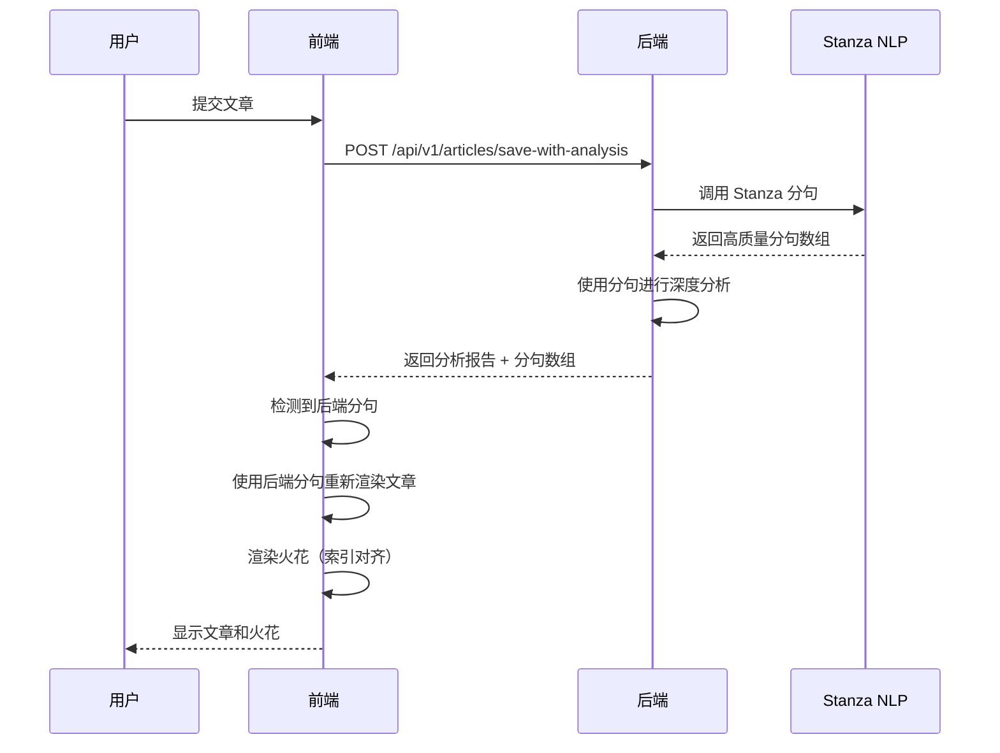

# 前后端分句一致性解决方案

## 问题描述

原有系统中，前端和后端使用不同的分句算法：
- **后端**：简单的正则表达式分句（精度低）
- **前端**：简单的正则表达式分句（精度低）
- **问题**：无法准确处理中文复杂句子，导致分句质量差

## 解决方案

### 1. 后端升级为 Stanza NLP 分句 ✅

**文件**: `backend/app/utils/sentence_splitter.py`

**改进**:
- ✅ 使用 Stanford NLP 的 Stanza 库进行高质量中文分句
- ✅ 正确处理引号、括号、省略号、感叹号等复杂标点
- ✅ 避免误拆分（人名、缩写等）
- ✅ 保留原有正则表达式方法作为回退方案
- ✅ 单例模式，全局复用 pipeline

**使用方法**:
```python
from app.utils.sentence_splitter import split_sentences

# 默认使用 Stanza（推荐）
sentences = split_sentences(text)

# 或使用正则表达式（快速但不准确）
sentences = split_sentences(text, use_stanza=False)
```

### 2. 后端分析服务返回分句结果 ✅

**文件**: `backend/app/services/unified_analysis_service.py`

**改进**:
- ✅ 在第81行添加：`report_json['sentences'] = sentences`
- ✅ 分句结果包含在分析报告中，传递给前端

**返回格式**:
```json
{
  "report": {
    "meta_info": {...},
    "concept_sparks": [...],
    "argument_sparks": [...],
    "sentences": [
      "这是第一句话。",
      "这是第二句话。",
      "这是第三句话。"
    ]
  },
  "metadata": {...}
}
```

### 3. 前端支持后端分句重新渲染 ✅

**文件**: `frontend/app/composables/useArticleRenderer.ts`

**新增方法**: `renderWithBackendSentences(sentences: string[])`
- ✅ 接收后端的分句数组
- ✅ 生成带句子 ID 的 HTML
- ✅ 智能段落分组（每10句一段）

### 4. 火花渲染器自动使用后端分句 ✅

**文件**: `frontend/app/composables/useSparkRendererV2.ts`

**改进**:
- ✅ 在 `renderSparks()` 中检查 `report.sentences`
- ✅ 如果存在后端分句，自动重新渲染文章内容
- ✅ 确保火花索引与后端分句一致

**工作流程**:
```typescript
// 1. 检查报告中是否有后端分句
if (report.sentences && report.sentences.length > 0) {
  // 2. 使用后端分句重新渲染文章
  const { renderWithBackendSentences } = useArticleRenderer()
  const newHtml = renderWithBackendSentences(report.sentences)
  containerEl.innerHTML = newHtml
}

// 3. 渲染火花（此时句子索引已对齐）
await renderSparkBadges(containerEl, groups)
```

## 数据流



## 优势

1. **分句质量大幅提升**
   - 准确识别中文句子边界
   - 正确处理复杂标点组合
   - 避免误拆分

2. **前后端一致**
   - 后端分析时使用的句子索引与前端显示的完全一致
   - 火花位置准确无误

3. **向后兼容**
   - 如果报告中没有 `sentences` 字段，自动使用前端分句
   - 不影响历史数据

4. **性能优化**
   - 后端使用单例模式，只加载一次 Stanza 模型
   - 前端只在必要时重新渲染

## 测试

### 安装 Stanza 中文模型

```bash
cd backend
python -m stanza.download('zh', processors='tokenize')
```

### 测试分句效果

```bash
cd backend
python test_stanza_splitter.py
```

### 测试完整流程

1. 启动后端服务
2. 提交一篇中文文章
3. 等待分析完成
4. 观察控制台日志：
   - 后端：`✅ 已将 X 个句子添加到报告`
   - 前端：`📊 检测到后端分句结果（Stanza），共 X 个句子`
   - 前端：`🔄 使用后端分句重新渲染文章内容...`
   - 前端：`✅ 文章内容已使用后端分句重新渲染`

## 文件修改清单

### 后端
- ✅ `backend/app/utils/sentence_splitter.py` - 升级为 Stanza 分句
- ✅ `backend/app/services/unified_analysis_service.py` - 返回分句结果
- ✅ `backend/test_stanza_splitter.py` - 新增测试脚本

### 前端
- ✅ `frontend/app/composables/useArticleRenderer.ts` - 新增 `renderWithBackendSentences`
- ✅ `frontend/app/composables/useSparkRendererV2.ts` - 支持后端分句重新渲染

## 注意事项

1. **Stanza 模型**
   - 首次运行需要下载中文模型（约 200MB）
   - 加载时间约 2-3 秒，但只加载一次（单例模式）

2. **段落分组**
   - 当前前端简化版：每10句一段
   - 可考虑后端也返回段落信息以提高准确性

3. **性能考虑**
   - Stanza 分句比正则表达式慢，但准确性高
   - 对于超长文章，可考虑使用缓存

## 未来改进方向

1. **后端返回段落信息**
   ```json
   {
     "paragraphs": [
       {
         "index": 0,
         "sentences": ["句子1", "句子2"]
       }
     ]
   }
   ```

2. **前端缓存分句结果**
   - 避免重复渲染

3. **支持英文分句**
   - Stanza 支持多种语言
   - 可根据语言自动选择模型

4. **分句质量指标**
   - 记录分句耗时
   - 统计平均句子长度
   - 提供分句质量评估
